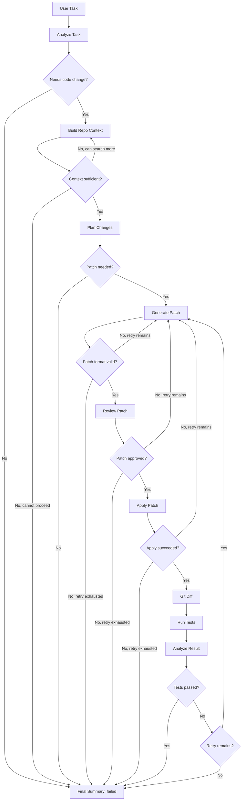

# Codeflow-agent Architecture

## 1. Purpose

This document provides a top-level architecture map for Codeflow-agent.

It describes:

- major system domains;
- runtime workflow;
- package layering direction;
- core artifacts;
- tool boundaries;
- architectural invariants;
- extension seams.

This document is intentionally not a full implementation specification. It should remain stable as the code evolves. Detailed function signatures, prompt wording, and test cases should live in code, tests, or smaller design notes when needed.

## 2. System Overview

Codeflow-agent is a single-agent LangGraph workflow for local repository modification.

At a high level:

```text
CLI
→ LangGraph workflow
→ AgentState
→ LLM nodes and local tools
→ patch-based repository modification
→ pytest verification
→ final summary
```

The MVP is built around a constrained loop:

```text
understand task
→ build context
→ plan
→ generate patch
→ review patch
→ apply patch
→ run tests
→ retry or summarize
```

The core architectural goal is to separate reasoning, tool execution, file modification, and verification.

## Current Implementation Snapshot

Milestone 1 is complete. The implemented runtime surface is intentionally
limited to read-only repository inspection:

```text
CLI
→ ToolResult-returning read-only tools
→ local filesystem inspection inside repo_root
```

Implemented modules include:

- `codeflow_agent.results` for the shared `ToolResult` contract;
- `codeflow_agent.paths` for repository-local path safety;
- `codeflow_agent.tools` for `list_files`, `read_file`, and pure-Python `search_code`;
- `codeflow_agent.cli` for `inspect`, `read`, and `search`.

LangGraph workflow nodes, LLM calls, patch editing, git diff inspection, pytest
execution tools, and bounded retry are still future milestones.

## 3. Domain Map

| Domain                 | Responsibility                                   | MVP Status | Known Gaps                                  |
| ---------------------- | ------------------------------------------------ | ---------- | ------------------------------------------- |
| CLI Interface          | Accept repository path, user task, and options   | M1 partial | Read-only commands exist; task flow remains |
| Workflow Orchestration | Run the LangGraph state machine                  | Required   | Multi-Agent orchestration is post-MVP       |
| Task Understanding     | Decide whether the task needs code changes       | Required   | Can start with simple structured LLM output |
| Repository Context     | List, search, and read relevant code             | M1 done    | Context compression arrives with workflow   |
| Planning               | Produce a scoped change plan                     | Required   | No separate Planner Agent in MVP            |
| Patch Editing          | Generate, review, and apply unified diffs        | Required   | New/delete file support can be limited      |
| Verification           | Run controlled pytest and extract result summary | Required   | No arbitrary shell execution                |
| Reporting              | Produce success, failure, or no-change summary   | Required   | Rich output can improve over time           |
| Safety Constraints     | Enforce path, command, and patch boundaries      | Required   | Full permission system is post-MVP          |

## 4. Layering and Dependency Direction

The preferred dependency direction is:

```text
CLI
→ Workflow
→ Nodes
→ Tool Interfaces
→ Local Implementations
→ Filesystem / Git / Pytest
```

### Layer Responsibilities

| Layer                  | Responsibility                                         |
| ---------------------- | ------------------------------------------------------ |
| CLI                    | Parse user input and display output                    |
| Workflow               | Define LangGraph nodes, edges, and termination logic   |
| Nodes                  | Read and write AgentState; call LLMs or tools          |
| Tool Interfaces        | Provide structured tool contracts                      |
| Local Implementations  | Perform filesystem, search, git, and pytest operations |
| External Local Systems | Filesystem, git, pytest, optional future ripgrep        |

### Layering Rules

- The CLI must not directly modify repository files.
- Nodes must not perform raw filesystem or subprocess operations directly.
- Nodes should call tools through explicit interfaces.
- Tools must not call LangGraph nodes.
- Tool implementations must not depend on CLI code.
- LLM output must be validated before changing the repository.
- Patch application must go through review and dry-run checks.

## 5. Runtime Workflow

The MVP workflow is:



The workflow must remain single-agent in the MVP.

## 6. Core Artifacts

The workflow passes structured artifacts through `AgentState`.

The main artifacts are:

| Artifact          | Purpose                                 |
| ----------------- | --------------------------------------- |
| `user_task`       | Original user request                   |
| `repo_root`       | Local repository root                   |
| `task_analysis`   | Structured understanding of the task    |
| `repo_context`    | Compressed repository context           |
| `plan`            | Proposed change plan                    |
| `patch`           | Unified diff generated by the model     |
| `patch_review`    | Review result before application        |
| `apply_result`    | Result of applying the patch            |
| `git_diff`        | Summary of current working tree changes |
| `test_result`     | Structured pytest result                |
| `error_summary`   | Compressed failure information          |
| `iteration_count` | Current retry count                     |
| `max_iterations`  | Retry limit                             |
| `status`          | Current workflow status                 |
| `final_output`    | Final user-facing summary               |

A simplified shape is:

```python
class AgentState(TypedDict):
    user_task: str
    repo_root: str

    task_analysis: dict | None
    repo_context: dict | None
    plan: dict | None

    patch: str | None
    patch_review: dict | None
    apply_result: dict | None
    git_diff: dict | None

    test_result: dict | None
    error_summary: dict | None

    iteration_count: int
    max_iterations: int

    status: str
    final_output: str | None
```

This is a conceptual shape, not a required final implementation.

## 7. Tool Boundary Map

Tools are grouped by risk level and responsibility.

| Group                      | Tools                                           | Boundary                                                    |
| -------------------------- | ----------------------------------------------- | ----------------------------------------------------------- |
| Read-only repository tools | `list_files`, `read_file`, `search_code`        | May inspect files only within `repo_root`                   |
| Patch tools                | `generate_patch`, `review_patch`, `apply_patch` | Must use unified diff; apply only after review              |
| Verification tools         | `run_tests`                                     | Must use allowlisted pytest commands with timeout           |
| Reporting tools            | `git_diff`                                      | May inspect repository changes but must not reset or commit |

### Tool Return Contract

Tools should return structured results:

```text
ok
data
summary
error_type
error_message
```

Tool outputs written into `AgentState` should be compressed.

## 8. Architectural Invariants

These rules must hold across the MVP.

### 8.1 Single-Agent MVP

The MVP uses one LangGraph workflow. Multi-Agent roles are extension seams only.

### 8.2 Patch-based Editing

The LLM must not directly overwrite files.

All code changes must flow through:

```text
generate patch
→ review patch
→ dry-run
→ apply patch
→ inspect git diff
```

### 8.3 Controlled Tool Use

The agent must not have arbitrary shell access.

Test execution must use controlled commands, `shell=False`, and a timeout.

### 8.4 Bounded Retry

Retry loops must be finite.

The workflow must stop when retry limits are reached.

### 8.5 Structured Failure

Failures must be represented in state.

The agent should not crash silently or produce a success summary after a failed operation.

### 8.6 Context Compression

The agent must not put the entire repository, full logs, or very large diffs into model context.

Repository context, test output, and git diff must be summarized before reuse.

### 8.7 Repository Boundary

All file access and patch application must be restricted to `repo_root`.

Path traversal, absolute paths, and forbidden files must be rejected.

## 9. Cross-cutting Concerns

### 9.1 Observability

The CLI should show enough information to debug the workflow:

- current stage;
- selected files;
- patch review result;
- test command;
- test result;
- retry count;
- final status.

Rich output is useful but should not drive architecture.

### 9.2 Testing

The implementation should favor small tests:

- tool-level tests;
- node-level tests;
- workflow edge tests;
- demo end-to-end test.

Tests should not depend on real LLM calls. Use fakes or stubs for model outputs.

### 9.3 Safety

Dangerous operations should fail closed.

Examples:

- invalid command → stop;
- forbidden path → reject patch;
- patch apply failure → retry or fail;
- dirty worktree at startup → fail unless explicitly allowed.

### 9.4 Maintainability

Implementation details should stay close to the code.

This architecture document should not duplicate:

- every function signature;
- every prompt;
- every test case;
- every error type;
- full roadmap details.

## 10. Post-MVP Extension Seams

The MVP should leave room for Multi-Agent evolution without implementing it early.

Possible post-MVP roles:

| Role              | Source in MVP                       |
| ----------------- | ----------------------------------- |
| Planner Agent     | `Analyze Task` + `Plan Changes`     |
| Coder Agent       | `Generate Patch`                    |
| Reviewer Agent    | `Review Patch`                      |
| Tester Agent      | `Run Tests` + `Analyze Result`      |
| Coordinator Agent | LangGraph routing and retry control |

Post-MVP direction:

```text
V1: Single-agent MVP
V2: Add Reviewer Agent
V3: Add Tester Agent
V4: Split Planner and Coder
V5: Add Coordinator for role orchestration
```

The key rule is that Multi-Agent collaboration must be artifact-driven, not free-form agent conversation.

Each role should produce or consume structured artifacts such as:

```text
plan
patch
patch_review
test_result
final_summary
```

Multi-Agent extension should begin only after the single-agent MVP is stable.
